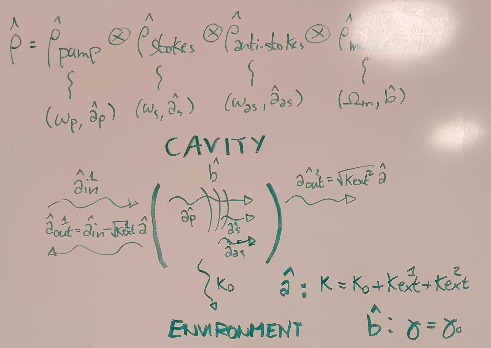
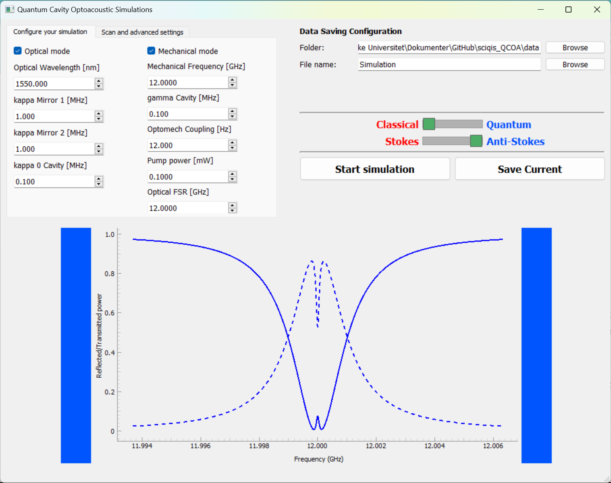
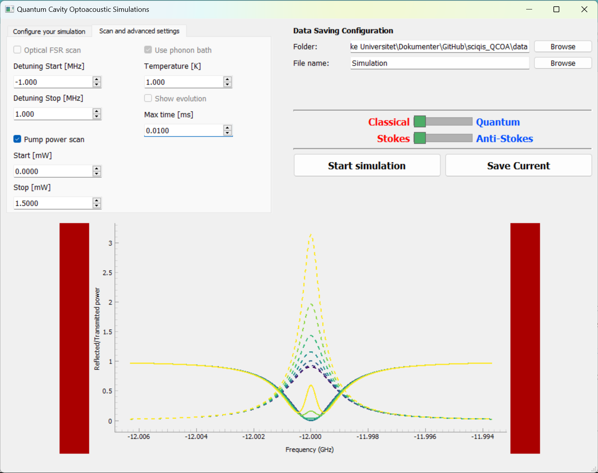

# sciqis_QCOA
 __Quantum Cavity Optoacoustic Simulations for low temperature systems__
 
## Project overview
 This projects wants to simulate the dynamics of an optomechanical system in the high-frequency sideband-resolved regime and compare the expected results between classical approximation, Master Equation solution, and Monte Carlo simulations.
 We are using the library `qutip` to implement the simulation framework.

## Package requirements
 To execute the project, you need to intall the following packages with `pip install`:
 - qutip
 - pyqt5
 - pyqtgraph

 Alternative, one can create a conda environment with `conda env create --name your_name --file=conda_environment.yml`

## Optomechanics theory
 The optomechanical system comprises (at least) two optical mode mode and a mechanical mode that allow the transfer of power between them. As reported in the following image, we are considering an optical cavity with coupling rate with the outside as $\kappa_{ext}^1$ and $\kappa_{ext}^2$, and with intrinsic losses $\kappa_{0}$ towards the environment. The mechanical cavity has loss rate $\gamma$. The two optical modes are called "pump" $(a_p)$ and "signal" $(a_s)$: the first provide the energy needed to excite the optomechanical interaction and its approximated by a classical field with an infinite reservoir of photons (undepleted pump approximation), the second is the mode under analysis. In particular, the reflectivity/transmittivity of the signal mode changing depending on the strength of the optomechanical interaction, thus changing the spectrum of the cavity, as display in the simulation result. The optomechanical interaction happens only when the difference between the frequency of the optical modes (i.e., the cavity FSR $|\omega_s-\omega_p|$) matches the mechanical frequency of the system called $\Omega_m$, and its strength is proportional to the amplitude of the cavity pump field $\alpha_p$ - that is proportional to the square root of the input power $P_{in}$- and the single-photon coupling rate $G_0$. 

 

 The optomechanical interaction is divided in Stokes and Anti-Stokes scattering depending if the frequency of the signal mode is smaller of larger compared to the pump one. The image below helps in identifying the different frequency that appear in the interaction. For Stokes scattering, if the pump power is sufficiently high, we achieve lasing, i.e., the realtive transmitted power is larger than 1. For Anti-Stokes scattering, a particular regime (strong coupling) is reached when the resonance peak splits into two peaks because of the high optomechanical interaction strength.

 

 The model of the optomechanical response, with classical assumption and from the quantum mechanics prediction, is summarized in the following equations:

 

 ## Optomechanical solvers
 The solution of the system is handled by the abstract class `CavitySolver` which create a solver that can be configure with the function `configure(**kwargs)`. The cavity reflectivity and transmittivity are calculated with `solve_cavity_RT()`, a method which relays on the function `_calculate_cavity_field()` for deriving the optical field inside the cavity using different models. Alternative, the class support the calculation of the time evolution of the cavity population (photons and phonons) until it reaches the steady-state through the function `solve_cavity_time_evolution()` which calls the overridable method `_calculate_time_evolution()`. Finally, we can get the configuration of the simulation with the function `get_current_configuration()`.

 The abstract class has been implemented with three different model:
 - `AnalyticalCavitySolver` provides an analytical approximated solution of the Langevin equation for the cavity fields of the optomechanical system.
 - `QuantumOpticalCavitySolver` implements a basic example of Master Equation solution using qutip for a bare optical cavity (no mechanical modes!). This was included because it is fast enough to test the application without needing to wait for the longer optomechacanical solution.
 - `QuantumOptomechanicalCavitySolver` implements the Master Equation solutions for the optomechanical cavity.

 The Master Equation solvers provides two interesting features:
 - They can derive the time evolution of the quantum system while considering the thermalization rate of the mechanical mode with the environment (open quantum system simulation)
 - They speed up the computation with a smart choice of the frequency steps and the dimensionality of the Hilbert space that is simulated, by respectively predicting the variability of the cavity spectrum and the expected number of photons and phonons in the modes.

 ## Graphical interface
 The solvers can be accesses and run through our `Simulator` class. The software provide a UI developed with `PyQt5` to simplify the change of the parameters and demonstrate the different models to the user.
 The following image present the graphical interface. On the left side, we have the selection of the simulation parameters (see [Theory section](#Optomechanics-theory)), while on the right we can select the destination folder and filename for the output files, the type of solver to use, and the Stokes/Anti-Stokes sideband we are simulating. The lower part of the interface displays the simulation output in form of the cavity spectral response.
 
 

 Other configuration options, allows to generate multiple plots while changing some parameters, e.g., the pump power (as shown in the image below) and the cavity detuning (i.e., the difference between the cavity FSR and the mechanical frequency). For the quantum model, we can select the temperature of the environment bath for the mechanical modes, or the generation of the time evolution of the system.

 

 The saving button allows to save three files containing the configuration of the GUI and the solver in Json format, the data visualized in the plot as csv file, and the displayed cavity spectral response.
 Some keyboard shortcut for the more commonly used commands as been added: you can find them by looking at the code or by experimenting with them!

## Development notes
 The project goals are:
 - [TOPIC1 - DONE] Compare the known analytical solution of the classical dynamics with the numerical steady-state solution of the Master equation describing the Lindbladian problem (+ compare with the numerical solution of the Langevin differential equations).
 - [TOPIC1 - DONE] Solve the same system dynamics with Monte Carlo simulations (time-evolution) and analyze the performances/requirements for convergence to the same solutions.
 - [TOPIC2 - DONE] Analyze a specific scenario, i.e., a low-temperature system when the mechanical system is close to the ground state, by verifying the assumption used to simplify the problem.
 - [TOPIC2 - PARTIALLY DONE] Extend the previous scenario into a open quantum system simulation to include typical effects observed at low temperatures, e.g., known decoherence channels for the acoustics.
 - [TOPIC2 - DONE] Compare the solution with the different approaches developed in the previous stages (correctness, performances, ...).
 - [TOPIC3 - PARTIALLY DONE] Try to simulate Brillouin lasing by considering the temporal evolution of the optical and mechanical states. In particular, we are interested in removing the undepleted pump assumption that is required by the analytical solution.
 - [TOPIC4 - TODO] Try to simulate multi-mode interaction by increasing the dimensionality of the problem and study the performances. In particular, we are interested in predict the effect of possible phonon-phonon and photon-photon interactions.
 