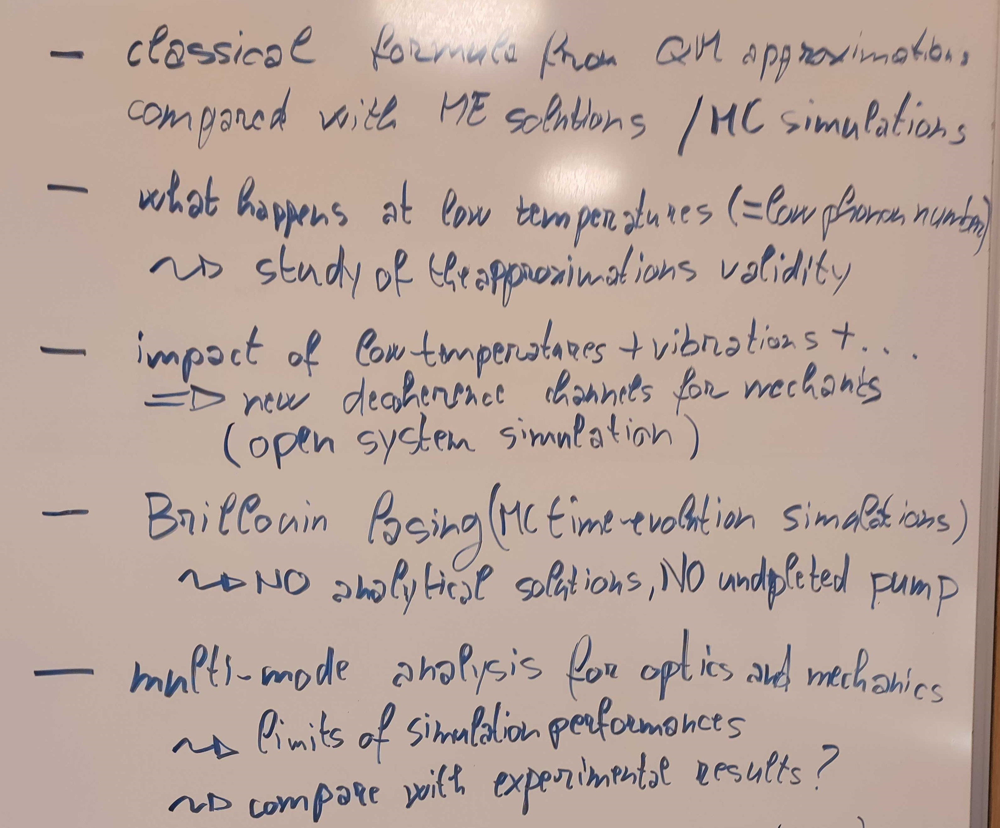
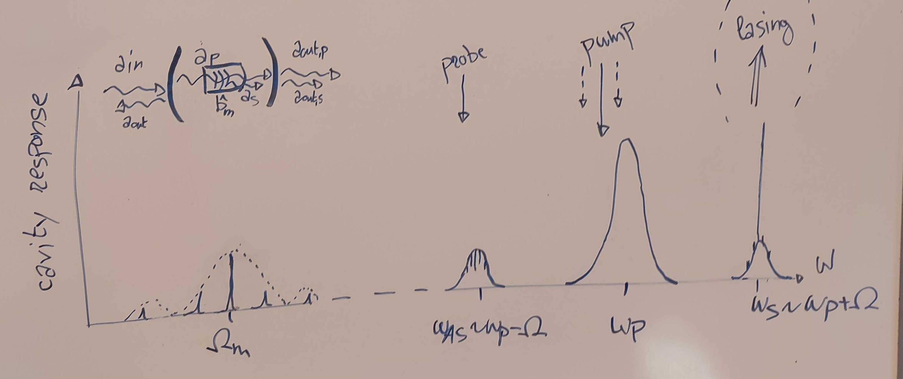

# sciqis_QCOA
 __Quantum Cavity Optoacoustic Simulations for low temperature systems__
 
## Project overview
 This projects wants to simulate the dynamics of an optomechanical system in the high-frequency sideband-resolved regime and compare the expected results between classical approximation, Master Equation solution, and Monte Carlo simulations.
 We are using the library `qutip` to implement the simulation framework.
 
 The project goals are:
 - [TOPIC1] Compare the known analytical solution of the classical dynamics with the numerical steady-state solution of the Master equation describing the Lindbladian problem (+ compare with the numerical solution of the Langevin differential equations).
 - [TOPIC1] Solve the same system dynamics with Monte Carlo simulations (time-evolution) and analyze the performances/requirements for convergence to the same solutions.
 - [TOPIC2] Analyze a specific scenario, i.e., a low-temperature system when the mechanical system is close to the ground state, by verifying the assumption used to simplify the problem.
 - [TOPIC2] Extend the previous scenario into a open quantum system simulation to include typical effects observed at low temperatures, e.g., known decoherence channels for the acoustics.
 - [TOPIC2] Compare the solution with the different approaches developed in the previous stages (correctness, performances, ...).
 - [TOPIC3] Try to simulate Brillouin lasing by considering the temporal evolution of the optical and mechanical states. In particular, we are interested in removing the undepleted pump assumption that is required by the analytical solution.
 - [TOPIC4] Try to simulate multi-mode interaction by increasing the dimensionality of the problem and study the performances. In particular, we are interested in predict the effect of possible phonon-phonon and photon-photon interactions.
 
 
 
 Here we report some useful sketches that represent the modes considered in the problem and the two solution (approximate classical analytical solution and Lindbladian equation) 

 

 
 
## Development notes
